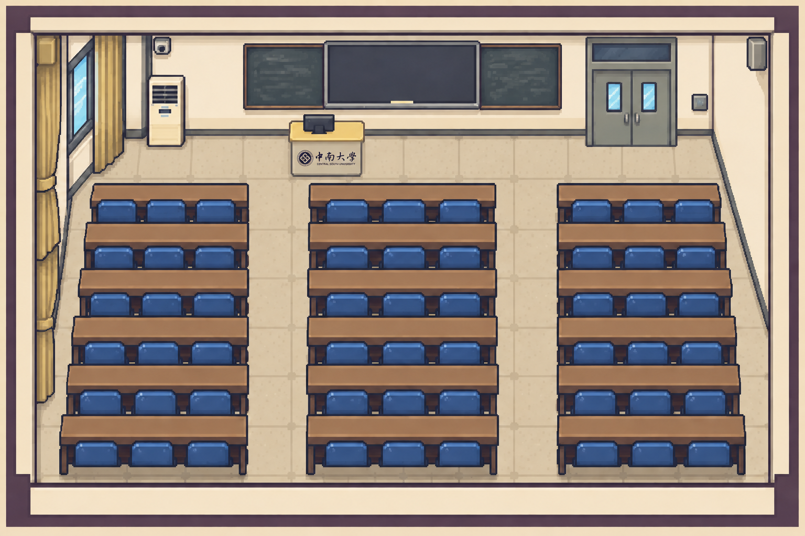

# muti-agent

多人格讨论工作台：选模式和主题，选几个人物入座，看他们围绕你的问题讨论或分工协作。讨论中可以暂停、插话、继续，讨论结束后还能接着追问。

项目按当前方向持续开发：围绕娱乐、辩论、情感分析和工作四种模式，完善人物库、讨论交互与场景表现。原有像素场景继续保留，3D 场景作为独立选项新增；人物模型与动作动画逐步适配，已接入能力和当前限制以本文及对应资源说明为准。

## 界面

**1. 模式 · 主题 · 场景**：娱乐 / 辩论 / 情感分析 / 工作 四选一，填上想讨论的问题，再挑一张场景图。


**2. 选择人物**：从该模式的人物库里挑人入座，辩论要正反方各至少一人，中立主持固定兼裁判。


**3. 讨论**：左边是场景，右边是工作区，可以暂停、对全体插话，也可以点成员私下说（只有他看得到，其他角色不知道），讨论结束还能接着追问。


**4. 工作 · 办公室**：13 个工位都能坐人。负责人在中央交换台开站会派活，大家分头干活，需要时走到同事工位当面讨论，写完互相评审，有冲突就进会议室对齐。画面按现实规矩排队：同屏最多两个气泡，气泡上标着谁对谁说。


场景图在 `frontend/public/scenes/`，六张分别是圆桌会议室、辩论室、办公室、中南大学教室、草地野餐、播客访谈间（正面视角，两人全身坐在扶手椅上访谈），也可以上传自己的图。例如中南大学教室：



加了 3D 场景之后，像素场景和各模式的默认场景都不变。在场景列表下方的「新增 3D 场景」中，还可单独选择「圆桌会议室 · 3D」「辩论室 · 3D」「办公室 · 3D」。仅主动选择这些新增场景时才加载三维模型，可拖动旋转、滚轮缩放，也能切回场景原图。人物继续使用现有的独立角色形象和状态动画，位置跟随视角；之前试生成的通用人物模型已撤下。模型来源、处理脚本和当前限制见 [`frontend/public/models/README.md`](frontend/public/models/README.md)。

## 四个模式

| 模式 | 引擎 | 人物 |
| --- | --- | --- |
| 娱乐 | 浏览器里的导演 + 演员引擎（`frontend/src/engines/entertainment/` + 底盘 `live/`）：导演看全场、提名每一步可能接话的人，谁真的开口按各人此刻的冲动抽，每个角色按自己的人设说、自己定看法（导演的话头不合人设可以不接）；能插嘴、冷场散场；可以暂停、@点名、私聊撺掇 | `frontend/personas/entertainment/` 7 位室友，加播客主持人阿麦，共 8 人 |
| 辩论 | 浏览器里的独立导演 + 辩手 + 裁判引擎（`frontend/src/engines/rational/`）：按正反方轮次交锋，主持或中立裁判判定；人物说法随现场变化 | `backend/人物/理性/` 5 人，构建时直接加载 |
| 情感分析 | 浏览器里的导演 + 演员引擎（`frontend/src/engines/emotion/` + 底盘 `live/`）：七种回应风格一起接住你的事，导演按「回应情绪 → 分清事实与感受 → 下一步行动」往前排、提名谁接话，谁开口按冲动抽、怎么说各人自己定，情绪（心疼、火气、担心、欣慰）一步步递进；有人问你时会停下来等你开口；可以暂停、@点名、私聊 | `frontend/personas/emotion/` 7 人 |
| 工作 | Node 会话后端（`frontend/server/work.ts`）：立项派活 → 分头干活 → 互相评审 → 定稿交付 | `frontend/personas/product/` 13 人 |

工作模式的办公室开放 13 个工位。负责人先在中央交换台开站会派活，成员并行写第一版，需要时到同事工位当面讨论；第一版作为文件交给同事评审，当面回应后改出第二版。负责人发现各部分有冲突时，会叫相关成员进会议室对齐、拍板，最后在交换台前宣布交付。记录显示交流双方，点开成员也能看到别人对他说的话。

画面上照现实的规矩排队，宁可整场拉长也不挤（规则在 `frontend/src/data/stageRules.ts` 和 `frontend/server/work.ts` 的 `Stage`）：模型照样几个人同时想、同时写，但一个人话没说完不起身、路没走完不开口；当面谈的两个人轮流说，上一句在气泡里停够看完的时间才出下一句；站会和会议要等人到齐、一次一个人说，散会等最后一句看完；全屏同时最多两个气泡，多出来的对话先等着；第一版是交出来的文件，照样出气泡（标题写「· 第一版」），记录里按文件样式显示，几份第一版错开交。走路时间按距离算，前端动画和后端排时间用同一份。截图所用的 13 人演示约 5 分钟，实际耗时随模型响应和交流次数变化。娱乐、情感分析和辩论本来就是一次一个人开口（小反应错开、插嘴立即截断），不受影响。

二维办公室支持走动、站会和会议室坐姿；「办公室 · 3D」支持 13 人入座，当前仍在各自工位表现工作状态。暂停会等待恢复后再推进工作，期间可以继续私聊；停止会中断模型请求和流程等待。人物通过文字产出方案，不会实际创建网站、App 或文件。流程、发言顺序、每个人能看到什么、异常处理等完整说明见 [`frontend/src/engines/product/README.md`](frontend/src/engines/product/README.md)。

在 `frontend/` 中运行 `npm run test:work` 可用假模型验证 13 人全流程、台上排队的规矩（按事件时间逐条核对）、当面谈排队、并发上限、暂停恢复和停止。发布前运行根目录的 `npm run build`，同时更新页面和服务端产物。

## 目录

- `frontend/`：网页和 Node 后端（`server/`），人物在 `personas/`，给各组的交接说明在 `docs/handoff/`。
- `backend/`：辩论人物与性格资料的原始文件；旧版 Python 服务保留作独立工具，网页运行不依赖它。
- `persona-protocol/`：人物文件格式的校验器，前端加载人物和图鉴导入都用它；命令行用法 `node persona-protocol/src/cli.mjs 文件.json`。
- `docs/screens/`：README 里用到的四张界面截图。

## 运行

本地只需启动前端开发服务器；四个模式共用它提供的模型代理。

| 进程 | 职责 | 默认地址 |
| --- | --- | --- |
| 前端开发服务器（Vite） | 页面与热更新、Node 会话后端、四个模式的模型转发 | http://localhost:5173 |

**环境要求**：Node.js `^20.19.0 || >=22.12.0`（Vite 8 的要求）；首次运行先在 `frontend/` 执行一次 `npm install`。

### 1. 配置模型凭据

把 `frontend/.env.example` 复制为 `frontend/.env`，填写三个变量：

| 变量 | 含义 | 示例 |
| --- | --- | --- |
| `LLM_API_KEY` | 服务商 API Key | `sk-...` |
| `LLM_BASE_URL` | 兼容 OpenAI `/chat/completions` 的接口地址 | `https://api.deepseek.com/v1` |
| `LLM_MODEL` | 模型名 | `deepseek-chat` |

- Node 侧依次加载 `.env`、`.env.local`，同名变量以 `.env.local` 为准；旧变量名 `ROUNDTABLE_*` 仍然兼容；
- `.env` 只在服务器端读取，不会打包进前端，也不纳入版本控制；
- 未配置的后果：四种模式发言时都会提示缺少 `LLM_API_KEY`。

### 2. 启动网页

```bash
cd frontend
npm run dev
```

一个 Vite 进程提供页面与热更新、Node 会话后端（`/api/health`、`/api/sessions`）及 `/api/llm/chat` 模型代理，Key 只留在服务器端。娱乐、情感分析和辩论分别在浏览器运行自己的引擎。

- 端口默认为 5173，被占用时 Vite 会自动顺延，**以终端输出的地址为准**；
- 请用终端输出的 `localhost` 地址打开（只监听 IPv6 回环时，`127.0.0.1` 连不上）；

### 3. 单端口发布（可选）

`node serve.mjs` 把静态页和 Node 模型代理合并到一根端口；不再启动 Python 子进程。

发布前设置至少 16 个字符的 `APP_ACCESS_PASSWORD`（可放在 `frontend/.env.production` 或进程环境变量）。服务启动后，浏览器访问页面会要求登录：用户名固定为 `roundtable`，密码是该变量的值。页面和全部 API 共用此校验；对外访问请使用 HTTPS，避免 Basic 凭据在传输中泄露。未配置密码时单端口服务会拒绝启动。

`serve.mjs` 在仓库根目录，下面两条也在根目录执行：

```bash
npm run build              # 构建页面和 Node 后端（即 frontend/ 里的 build 和 build:server）
APP_ACCESS_PASSWORD='replace-with-a-long-random-password' PORT=8080 npm start  # 默认端口 5173
```

若存在 `frontend/.env.production`，它会覆盖 `.env` 中的模型配置（本地 `npm run dev` 不读它）。
