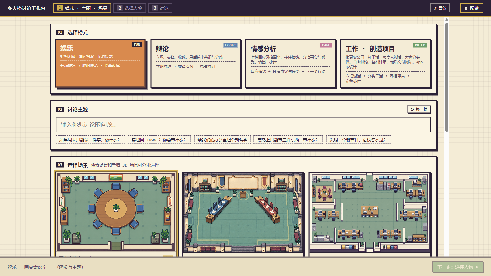
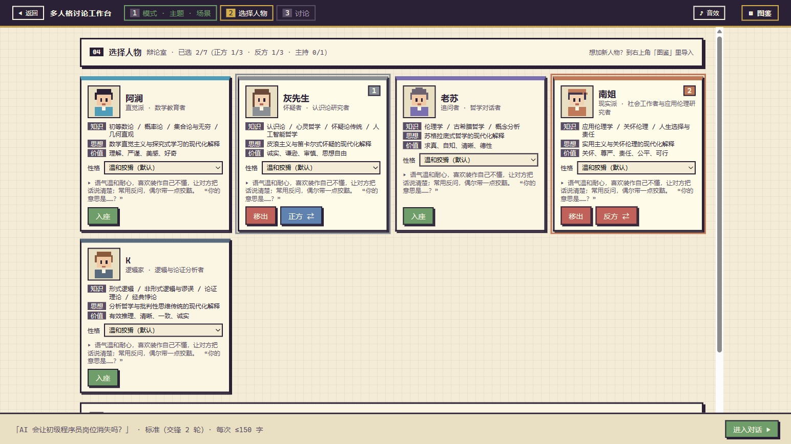
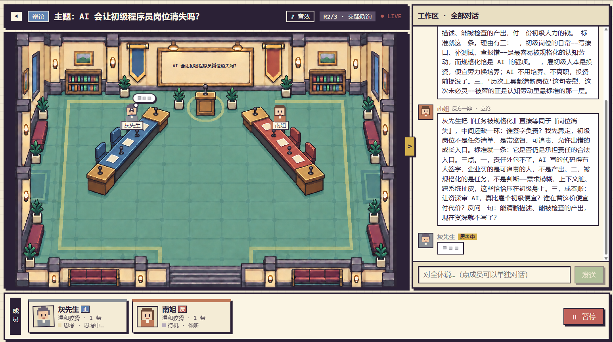
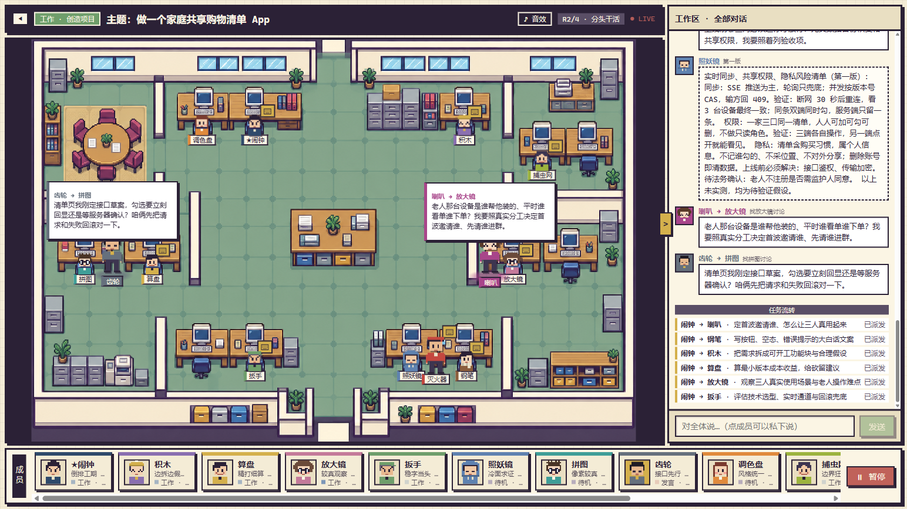

# muti-agent

多人格讨论工作台：选择模式、主题、场景和人物，观看他们讨论或分工协作。支持暂停、插话、点名、私聊，以及结束后的追问。

## 当前能力

| 模式 | 主要流程 | 内置人物 |
|---|---|---|
| 娱乐 | 导演与演员接话、脑洞闲聊、总结收尾 | 8 人 |
| 辩论 | 正反方立论、交锋、总结共识与分歧，不评分或判胜负 | 5 人 |
| 情感分析 | 回应情绪 → 分清事实与感受 → 下一步行动 | 7 人 |
| 工作 | 负责人派活 → 并行产出 → 同事评审 → 定稿交付 | 13 人 |

工作模式的产物是讨论中的文本方案，不会实际创建网站、App 或项目文件。办公室支持 13 个工位、走访、站会和会议；动作与气泡按顺序排队。详细流程见[工作引擎说明](frontend/src/engines/product/README.md)。

## 快速开始

需要 Node.js `^20.19.0 || >=22.12.0`。以下命令都在仓库根目录执行：

```powershell
npm run install:all
```

首次配置且 `frontend/.env` 不存在时，复制[配置模板](frontend/.env.example)为 `frontend/.env`，填写 `LLM_API_KEY`、`LLM_BASE_URL`、`LLM_MODEL`。已有配置直接沿用。

```powershell
npm --prefix frontend run dev
```

打开终端显示的 localhost 地址，默认端口 5173，端口占用时会顺延。一个 Vite 进程提供页面、Node 会话和模型代理；网页运行不需要启动 Python。娱乐、辩论和情感分析在浏览器调度，工作通过 Node/SSE 运行。凭据仅由服务器读取，不进入前端或 Git；开发配置可由 `.env.local` 覆盖，兼容旧 `ROUNDTABLE_*` 变量。

## 场景与实验

六个原有 2D 场景继续可用：圆桌、辩论室、办公室、教室、草地野餐和播客访谈间，也支持上传自定义场景。主动选择同名「· 我的世界」选项才加载 MC 3D，讨论中可以切回原图。

| 页面（服务地址后追加） | 用途 | 生产构建 |
|---|---|---|
| `/` | 正式工作台，默认沿用旧六个 MC 房间 | 包含 |
| `/stage-lab.html?scene=roundtable-mc` | 六场景预览；加 `&v=2` 看圆桌实验样板 | 包含 |
| `/mc-lab.html?scene=roundtable&v=2` | 内置人物、动作和材质对比 | 仅开发 |
| `/avatar-lab.html` | 人物、表情、姿态、椅子和地面实验 | 仅开发 |

v2 只实现了圆桌，其他五个场景回退旧版；预览可运行不代表用户视觉验收通过。素材来源见[MC 署名](frontend/public/mc/THIRD-PARTY.md)、[叠加包说明](frontend/mc-packs/README.md)及[高清对比包许可](frontend/public/mc/hd/CREDITS.md)。

## 构建、检查与发布

```powershell
npm test
npm run build
```

测试使用本地数据或假模型。完整构建同时更新 `frontend/dist` 和 `server-dist/api.mjs`；单独运行 `npm --prefix frontend run build` 只构建页面。检查范围和限制见 [VERIFY.md](VERIFY.md)，已复现的自由镜头边界问题见[审计残留](docs/MAINTENANCE_AUDIT.md#待决项与残留)。

发布时在根目录设置至少 16 个字符的访问密码并启动服务。PowerShell 示例：

```powershell
$env:APP_ACCESS_PASSWORD='replace-with-a-long-random-password'
$env:PORT='8080'
npm start
```

浏览器登录用户名为 `roundtable`，密码为 `APP_ACCESS_PASSWORD`。页面和 API 共用鉴权；对外发布使用 HTTPS。`serve.mjs` 默认端口 5173，读取 `.env`、`.env.production` 和进程环境，不启动 Python。Bash 可用 `APP_ACCESS_PASSWORD='replace-with-a-long-random-password' PORT=8080 npm start`。

## 项目导航

```text
frontend/src/          工作台、四模式引擎、2D 与 MC 运行实现
frontend/server/       Node 模型代理、会话和工作流程
frontend/personas/     娱乐、情感、工作人物
frontend/public/      产品场景、MC 运行资产及许可证
frontend/docs/        当前前端文档；历史资料统一在 archive/
backend/              共享辩论人物/性格，以及独立 Python 工具
persona-protocol/     人物格式与校验
docs/                 人物上传指南、维护审计与产品截图
```

当前目录和调用关系见 [ARCHITECTURE.md](ARCHITECTURE.md)。`node_modules`、`dist`、`server-dist` 是本地依赖或构建输出；`.shots`、`.verify` 是忽略的临时数据，不是源码或参考素材目录。

| 要做的事 | 从这里开始 |
|---|---|
| 修改项目 | [AGENTS.md](AGENTS.md) → [STANDARDS.md](STANDARDS.md) → [ARCHITECTURE.md](ARCHITECTURE.md) |
| 前端、服务、实验台维护 | [frontend/README.md](frontend/README.md)和[前端文档](frontend/docs/README.md) |
| 创建或上传人物 | [人物指南](docs/人物角色创建与上传说明.md) |
| 查遗留分类、素材取舍和恢复点 | [维护审计](docs/MAINTENANCE_AUDIT.md)及[历史资料索引](frontend/docs/archive/README.md) |
| 查 Python 工具 | [backend/README.md](backend/README.md) |

<details>
<summary>2D 工作台截图</summary>

模式、主题与场景：



选择人物：



讨论与私聊：



工作办公室：



</details>
